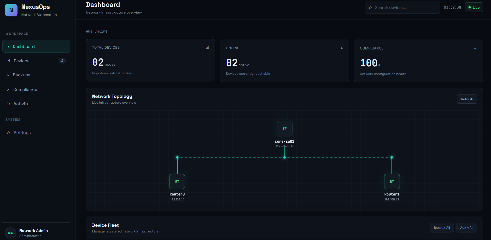
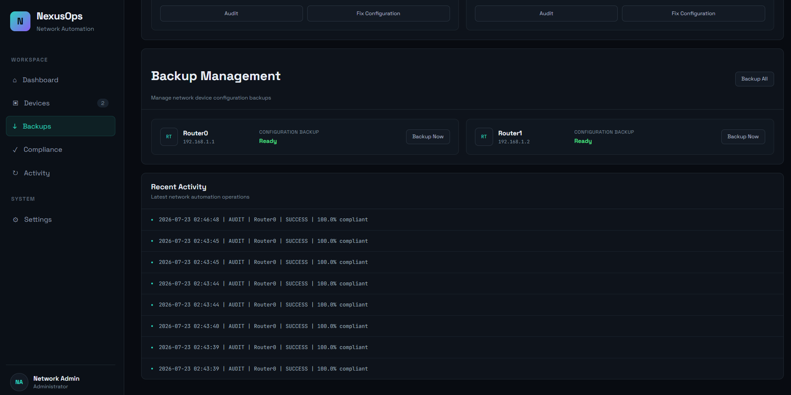

<div align="center">

# 🛰️ NexusOps

### Network Automation & Configuration Compliance Platform

**Centralized device monitoring, drift detection, and automated remediation — built as a full-stack network operations dashboard.**

[](https://www.python.org/)
[](https://fastapi.tiangolo.com/)
[](https://react.dev/)
[](https://vitejs.dev/)
[]()
[]()

[Overview](#-overview) • [Features](#-key-features) • [Architecture](#-architecture) • [API](#-rest-api) • [Getting Started](#-running-nexusops-locally) • [Roadmap](#-roadmap)

</div>

<p align="center">
  <a href="https://nexusops-one.vercel.app">
    <strong>🚀 Live Demo</strong>
  </a>
  &nbsp;&nbsp;•&nbsp;&nbsp;
  <a href="https://nexusops-api.onrender.com/docs">
    <strong>📚 API Documentation</strong>
  </a>
</p>

---

## 📌 Overview

As a network grows, manually verifying configurations, catching drift, and keeping backups current stops scaling. Engineers end up doing detective work — diffing configs by eye, hoping nothing slipped through.

**NexusOps turns that detective work into a pipeline.** It centralizes device inventory, configuration auditing, baseline compliance, backups, and automated remediation behind a single operations dashboard — so configuration drift is *detected and fixed*, not discovered during an outage.

> **Current status:** Simulation-based automation environment, fully functional end-to-end.
> **Next milestone:** SSH integration with virtual Cisco IOS devices for real configuration retrieval and deployment.

## 📸 Screenshots

### Network Operations Dashboard



### Device Fleet & Automation


### Compliance & Backup Management



```text
Device Inventory
       │
       ▼
Configuration Audit
       │
       ▼
Baseline Comparison
       │
       ├──── Compliant ────────────► Monitoring
       │
       └──── Drift Detected
                    │
                    ▼
            Missing Commands
                    │
                    ▼
          Automated Remediation
                    │
                    ▼
             Re-Audit Device ──────► 100% Compliance
```

---

## ✨ Key Features

| Feature | What it does |
|---|---|
| 🖥️ **Operations Dashboard** | Real-time visibility into device inventory, availability, topology, compliance, and recent activity |
| ✅ **Compliance Engine** | Compares live device configuration against an approved baseline and calculates a compliance score |
| 📉 **Drift Detection** | Flags any configuration change that violates the approved baseline the moment it's audited |
| 🔧 **Automated Remediation** | Identifies missing commands and deploys the fix — no manual config-pushing |
| 💾 **Configuration Backups** | Timestamped, per-device backups, individually or in bulk |
| 📜 **Activity Tracking** | Every audit, deployment, and backup is logged and surfaced on the dashboard |
| 🔍 **Device Search** | Instantly filter devices by name, IP address, or platform |

### Compliance Engine, in detail

```text
Approved Baseline
        +
Device Configuration
        │
        ▼
Configuration Comparison
        │
        ├── Required commands present
        │
        └── Missing commands detected
                    │
                    ▼
              Compliance Score
```

### Drift Detection — example

```text
Router0
  Before drift  → Compliance: 100%
  Command removed from running-config
  After audit   → Compliance: 80%  |  Status: ACTION REQUIRED
```

### Automated Remediation — example

```text
Audit → Detect Missing Configuration → Fix Configuration
      → Deploy Required Commands → Re-Audit → 100% Compliance
```

---

## 🏗️ Architecture

```text
┌──────────────────────────────────────────────┐
│                   NexusOps                    │
└──────────────────────────────────────────────┘

                  React + Vite
                       │
                       │  REST API
                       ▼
                FastAPI Backend
                       │
        ┌──────────────┼──────────────┐
        │              │              │
        ▼              ▼              ▼
  Audit Engine    Backup Engine   Deploy Engine
        │              │              │
        └──────────────┼──────────────┘
                       │
                       ▼
               Device Abstraction
                       │
              ┌────────┴────────┐
              │                 │
              ▼                 ▼
        Simulation Mode     Future Lab Mode
                                 │
                                 ▼
                          SSH / Netmiko
                                 │
                                 ▼
                          Network Devices
```

The network-operations layer is deliberately decoupled from the API layer. That's what lets the current **Simulation Mode** be swapped for real SSH/Netmiko device communication in Phase 2 without touching the audit, backup, or deploy engines.

---

## 🧰 Tech Stack

<table>
<tr>
<td valign="top" width="33%">

**Frontend**
- React
- Vite
- JavaScript
- CSS
- Fetch API

</td>
<td valign="top" width="33%">

**Backend**
- Python
- FastAPI
- Pydantic
- Uvicorn

</td>
<td valign="top" width="33%">

**Automation — Current**
- Configuration baseline validation
- Simulated device state
- Compliance calculation
- Remediation workflow
- Backup workflow

**Automation — Planned**
- Netmiko + SSH
- Cisco IOS
- Real `show running-config`
- Real configuration deployment

</td>
</tr>
</table>

---

## 📁 Project Structure

```text
NexusOps/
│
├── backend/
│   ├── app.py                  # FastAPI entrypoint
│   ├── audit.py                # Compliance auditing logic
│   ├── backup.py                # Configuration backup workflow
│   ├── deploy.py                 # Configuration deployment engine
│   ├── activity.py                # Activity logging
│   ├── config.py                   # App configuration
│   ├── models.py                    # Pydantic models
│   ├── ssh.py                         # Future SSH/Netmiko integration
│   ├── devices.json                    # Device inventory
│   ├── device_state.json                # Simulated device state
│   ├── requirements.txt
│   │
│   ├── templates/
│   │   └── router_baseline.txt          # Approved configuration baseline
│   │
│   └── backups/                           # Generated backup files
│
├── frontend/
│   ├── src/
│   │   ├── App.jsx
│   │   ├── App.css
│   │   ├── index.css
│   │   └── main.jsx
│   │
│   ├── public/
│   ├── package.json
│   └── vite.config.js
│
├── .gitignore
└── README.md
```

---

## 🔌 REST API

| Method | Endpoint | Description |
|---|---|---|
| `GET` | `/` | API information |
| `GET` | `/health` | Backend health check |
| `GET` | `/devices` | Retrieve network devices |
| `GET` | `/audit/{device_id}` | Audit a single device |
| `GET` | `/audit-all` | Audit all devices |
| `POST` | `/deploy/{device_id}` | Deploy configuration to a device |
| `POST` | `/backup/{device_id}` | Back up a single device |
| `POST` | `/backup-all` | Back up all devices |
| `GET` | `/activities` | Retrieve automation activity log |

Interactive, auto-generated API docs are available at:

```text
/docs
```

---

## 🚀 Running NexusOps Locally

### 1. Clone the repository

```bash
git clone <YOUR-GITHUB-REPOSITORY-URL>
cd NexusOps
```

### 2. Backend setup

```bash
python -m venv venv
```

Activate the environment (Windows):

```bash
venv\Scripts\activate
```

Install dependencies:

```bash
pip install -r backend/requirements.txt
```

Start the FastAPI server:

```bash
uvicorn backend.app:app --reload
```

| Service | URL |
|---|---|
| Backend | `http://127.0.0.1:8000` |
| API docs | `http://127.0.0.1:8000/docs` |

### 3. Frontend setup

```bash
cd frontend
npm install
```

Create `frontend/.env`:

```env
VITE_API_URL=http://127.0.0.1:8000
```

Start the dev server:

```bash
npm run dev
```

| Service | URL |
|---|---|
| Frontend | `http://localhost:5173` |

---

## 🖼️ Screenshots

> Dashboard screenshots will be added after the final UI/deployment build.

<!--

-->

---

## 🔁 Example Compliance Workflow

A device's baseline requires:

```text
ip domain-name nexusops.local
ip ssh version 2
service password-encryption
```

If a required command is missing, NexusOps flags the drift:

```text
Router0
Compliance: 80%
Missing configuration detected
```

The remediation workflow restores compliance automatically:

```text
80% Compliance → Configuration Fix → Missing Command Applied
              → Re-Audit → 100% Compliance
```

---

## 🧪 Simulation Mode

The current build runs on a simulated device state so the full automation architecture can be developed and demonstrated without physical network hardware. Simulation Mode currently supports:

- Device inventory
- Configuration auditing
- Configuration drift
- Compliance scoring
- Configuration deployment state
- Configuration backups
- Activity tracking

This lets the API and automation workflows be validated independently of real infrastructure — before the SSH/Netmiko layer goes live in Phase 2.

---

## 🗺️ Roadmap

### Phase 1 — Platform Foundation ✅
- [x] React operations dashboard
- [x] FastAPI backend
- [x] Device inventory
- [x] Network topology visualization
- [x] Configuration baseline
- [x] Compliance engine
- [x] Configuration drift detection
- [x] Automated remediation workflow
- [x] Configuration backups
- [x] Activity tracking
- [x] Device search

### Phase 2 — Real Network Integration 🚧
- [ ] Virtual Cisco IOS lab
- [ ] SSH device connectivity
- [ ] Netmiko integration
- [ ] Retrieve real `show running-config`
- [ ] Real-time device availability
- [ ] Deploy configuration through SSH
- [ ] Retrieve real configuration backups
- [ ] Post-remediation verification

### Phase 3 — Advanced Automation 🔮
- [ ] Configuration versioning
- [ ] Backup comparison / diff
- [ ] Role-based access control
- [ ] Scheduled compliance audits
- [ ] Multi-vendor device support
- [ ] NETCONF / RESTCONF integration

---

## 🎯 Engineering Goals

NexusOps exists to explore the intersection of:

**Network Engineering × Backend Engineering × Automation × DevOps**

Rather than treating network management as a set of manual, one-off commands, this project models network operations as **programmable workflows** — exposed through a REST API and surfaced through a centralized dashboard.

---

## 🔒 Security

- Sensitive environment variables are excluded from version control
- The repository does not intentionally store production device credentials
- Real-device integration (Phase 2) will use environment-based credential management rather than hardcoded authentication

---

## 🔭 Future Vision

The long-term goal is to evolve NexusOps from a simulation-backed platform into a device-integrated network operations system capable of running the full loop —

```text
Observe → Audit → Detect Drift → Remediate → Verify → Backup
```

— across multiple real network devices, through secure automation protocols.

---

## 👤 Author

**Abhinav**
B.Tech Computer Science & Engineering
Interested in AI, Backend Engineering, Network Automation, and Infrastructure Software.

---

## 📄 License

This project is currently intended for educational and portfolio purposes.
